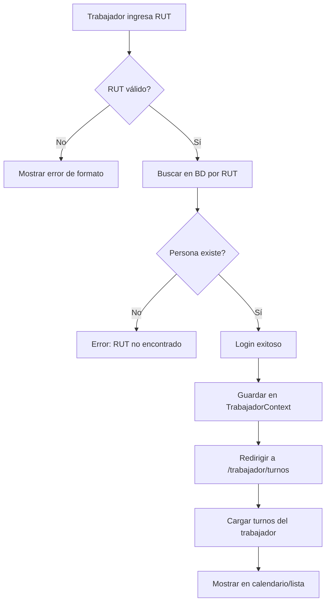

# 👷 Visualizador de Turnos para Trabajadores

## 📋 Descripción General

Nueva funcionalidad agregada al sistema que permite a los trabajadores visualizar sus turnos de forma independiente, sin necesidad de acceso administrativo. Los trabajadores pueden ingresar solo con su RUT y ver su calendario de turnos personalizado.

## 🎯 Características Principales

### ✅ Login Simplificado
- **Autenticación por RUT**: Los trabajadores ingresan solo con su RUT chileno
- **Validación automática**: El RUT se valida automáticamente con dígito verificador
- **Formateo automático**: El RUT se formatea mientras se escribe (12.345.678-9)
- **Diseño atractivo**: Usa el mismo SVG dinámico y animaciones del login administrativo

### 📅 Visualizador de Turnos
- **Vista de calendario semanal**: Calendario visual similar al administrativo pero en modo solo lectura
- **Vista de lista**: Listado detallado de turnos con toda la información
- **Navegación semanal**: Botones para navegar entre semanas (anterior/siguiente/hoy)
- **Estadísticas personales**: Muestra turnos de hoy, activos, completados y programados
- **Información detallada**: Fecha, hora, almuerzo, puesto, ubicación y notas

## 🚀 Acceso

### URLs de Acceso
- **Login Trabajadores**: `/trabajador/login`
- **Vista de Turnos**: `/trabajador/turnos` (requiere autenticación)
- **Login Admin**: `/` (ruta original, sin cambios)

### Flujo de Usuario
1. El trabajador accede a `/trabajador/login`
2. Ingresa su RUT (con o sin formato)
3. El sistema valida el RUT y busca la persona en la base de datos
4. Si existe, se autentica y redirige a `/trabajador/turnos`
5. Puede ver su calendario y turnos personalizados
6. Puede cerrar sesión con el botón "Salir"

## 🔧 Componentes Creados

### 1. **TrabajadorContext.jsx**
```
Ubicación: src/contexts/TrabajadorContext.jsx
```
- Contexto separado del admin para manejar la sesión del trabajador
- Guarda datos en localStorage bajo la clave `trabajador-auth`
- Funciones: `loginTrabajador()`, `logoutTrabajador()`

### 2. **rutValidator.js**
```
Ubicación: src/utils/rutValidator.js
```
- Utilidades para validación y formateo de RUT chileno
- Funciones principales:
  - `validarRut(rut)`: Valida RUT con dígito verificador
  - `formatRut(rut)`: Formatea con puntos y guión
  - `cleanRut(rut)`: Limpia formato
  - `calcularDv(rutSinDv)`: Calcula dígito verificador

### 3. **LoginTrabajador.jsx**
```
Ubicación: src/pages/LoginTrabajador.jsx
```
- Página de login simplificada solo con campo RUT
- Usa el mismo diseño y animaciones que el login administrativo
- Valida RUT antes de consultar la base de datos
- Muestra mensajes de error claros

### 4. **TurnosViewer.jsx**
```
Ubicación: src/pages/TurnosViewer.jsx
```
- Visualizador de turnos personalizados del trabajador
- Modo solo lectura (sin botones de editar/eliminar)
- Muestra estadísticas personales
- Integra el calendario semanal existente
- Navegación semanal completa

### 5. **Helpers de Supabase**
```
Ubicación: src/services/supabaseHelpers.js (modificado)
```
Nuevas funciones agregadas:
- `getPersonaByRut(rut)`: Busca persona por RUT normalizado
- `getTurnosByPersonaId(personaId, filters)`: Obtiene turnos filtrados por persona

## 🗂️ Modificaciones a Archivos Existentes

### App.jsx
Se agregaron las rutas para trabajadores sin modificar las rutas administrativas:

```javascript
// Rutas públicas para trabajadores
<Route path="/trabajador/*" element={
  <TrabajadorProvider>
    <Routes>
      <Route path="login" element={<LoginTrabajador />} />
      <Route path="turnos" element={<TurnosViewer />} />
    </Routes>
  </TrabajadorProvider>
} />

// Rutas de administración (sin cambios)
<Route path="/*" element={
  <AuthProvider>
    <AppRoutes />
  </AuthProvider>
} />
```

## 🔐 Seguridad

### Autenticación
- ✅ Separación total entre sesión de admin y trabajador
- ✅ Cada una usa su propio contexto y localStorage
- ✅ No hay conflicto entre las dos autenticaciones
- ✅ El trabajador solo puede ver SUS propios turnos

### Validación
- ✅ RUT validado con algoritmo de dígito verificador chileno
- ✅ Búsqueda en base de datos solo con RUT normalizado
- ✅ Protección de rutas: `/trabajador/turnos` redirige al login si no está autenticado
- ✅ Solo lectura: el trabajador no puede modificar turnos

## 📊 Base de Datos

### Requisitos
La tabla `personas` debe tener:
- Campo `rut` (TEXT, UNIQUE)
- Los RUTs deben estar almacenados SIN puntos ni guiones
- Ejemplo: `123456789` en vez de `12.345.678-9`

### SQL de Verificación
```sql
-- Verificar que existe el campo rut
SELECT column_name, data_type 
FROM information_schema.columns 
WHERE table_name = 'personas' AND column_name = 'rut';

-- Ver personas con RUT
SELECT id, nombre, rut, tipo 
FROM personas 
WHERE rut IS NOT NULL 
LIMIT 10;
```

## 🎨 Diseño y UX

### Características Visuales
- ✨ Mismo tema de "Punta de Lobos" con olas animadas
- 🌊 SVG holográfico animado igual al login admin
- 📱 Diseño responsive para móviles y tablets
- 🎨 Colores consistentes: teal/cyan para branding
- ⚡ Animaciones suaves de transiciones

### Navegación
- 👤 Muestra nombre y RUT del trabajador autenticado
- 🔄 Botón de actualizar para recargar turnos
- 📅 Cambio entre vista calendario y lista
- ⬅️➡️ Navegación entre semanas
- 🏠 Botón "Hoy" para volver a la semana actual
- 🚪 Botón "Salir" para cerrar sesión

## 🧪 Pruebas Recomendadas

### Pruebas Funcionales
1. ✅ Login con RUT válido existente en BD
2. ✅ Login con RUT válido pero no existente (debe mostrar error)
3. ✅ Login con RUT inválido (debe mostrar error de formato)
4. ✅ Visualización de turnos en calendario
5. ✅ Visualización de turnos en lista
6. ✅ Navegación entre semanas
7. ✅ Cierre de sesión
8. ✅ Acceso directo a `/trabajador/turnos` sin login (debe redirigir)

### Casos de Prueba
```javascript
// RUTs de prueba válidos (formato chileno)
const rutsPrueba = [
  '11.111.111-1',
  '22.222.222-2',
  '12.345.678-9'
]

// RUTs inválidos
const rutsInvalidos = [
  '11.111.111-2', // DV incorrecto
  '123', // Muy corto
  'ABCDEFGH-I' // No numérico
]
```

## 📱 Compatibilidad

- ✅ Chrome, Firefox, Safari, Edge (últimas versiones)
- ✅ Dispositivos móviles iOS y Android
- ✅ Tablets
- ✅ Responsive design completo

## 🔄 Flujo de Datos



## 🎯 Ventajas de la Implementación

1. **Separación de Contextos**: No interfiere con el sistema administrativo
2. **Seguridad**: Cada trabajador solo ve sus propios turnos
3. **UX Consistente**: Usa los mismos componentes visuales
4. **Código Limpio**: Reutiliza helpers y componentes existentes
5. **Mantenibilidad**: Fácil de extender o modificar
6. **No Invasivo**: Cero cambios en las rutas administrativas

## 📝 Notas Importantes

- Los trabajadores NO necesitan crear cuenta, solo existir en la tabla `personas`
- El RUT en la BD debe estar sin formato (sin puntos ni guiones)
- La sesión se guarda en localStorage independiente del admin
- El calendario es de solo lectura (no se pueden crear/editar turnos)
- Se puede agregar link al login de trabajadores desde el login admin y viceversa

## 🚀 Próximas Mejoras Sugeridas

1. **Notificaciones**: Avisos push cuando se asigna un nuevo turno
2. **Exportar PDF**: Permitir descargar calendario personal en PDF
3. **Historial**: Ver turnos pasados y estadísticas personales
4. **Cambio de turno**: Solicitar intercambio con otro trabajador
5. **Confirmación**: Botón para confirmar asistencia a turno
6. **Comentarios**: Permitir agregar notas personales (solo lectura para admin)

## 📞 Soporte

Para dudas o problemas:
- Revisar logs de consola del navegador
- Verificar que el RUT esté en la base de datos
- Confirmar que las variables de entorno de Supabase estén configuradas
- Revisar que el trabajador tenga turnos asignados en la semana actual

---

**Fecha de Implementación**: Octubre 2025
**Versión**: 1.0.0
**Estado**: ✅ Completado y Funcional
